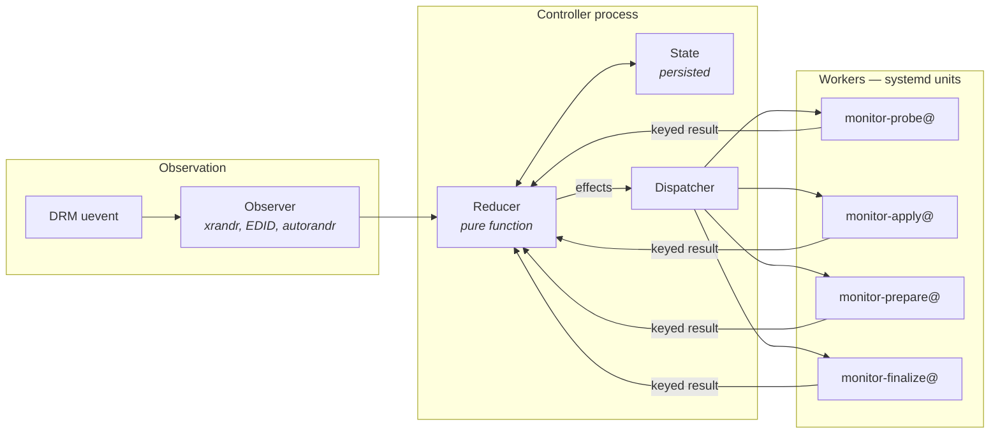
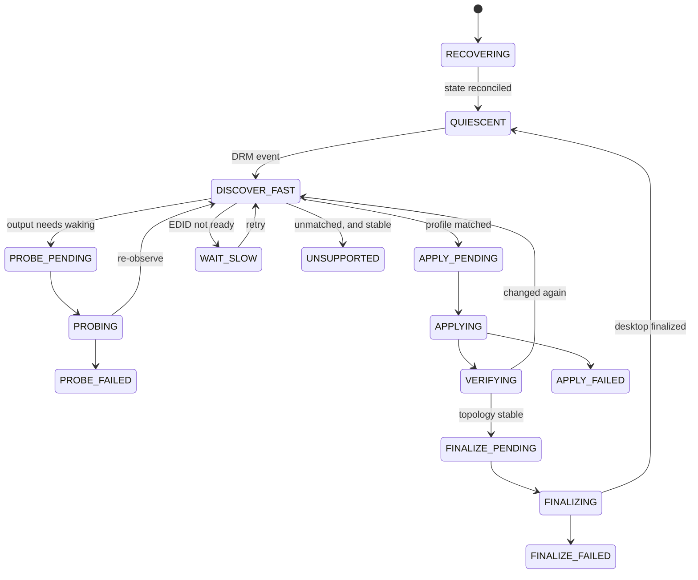
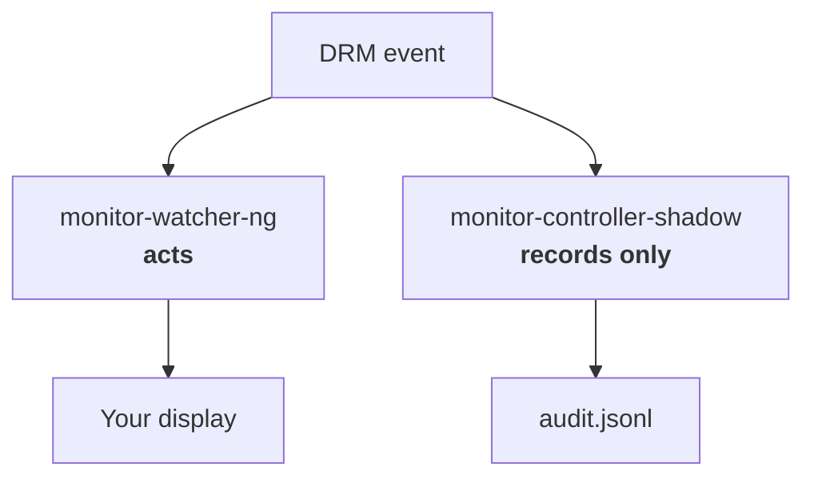

# The monitor controller

The new display-management system: a typed Python state machine that
replaces the shell watcher loop. It is **not authoritative yet** — it runs
alongside the current system in observe-only mode while it earns trust.

- New to all this? [The monitor system](monitor-system.md) explains the
  overall picture and everyday operations.
- The autorandr layer underneath is documented in
  [Autorandr-based monitor management](autorandr-monitor-management.md).
- Design rationale lives in
  [the architecture spec][arch] and [the state machine spec][v2].

[arch]: ../specs/monitor-controller-python-architecture.md
[v2]: ../specs/monitor-watcher-state-machine-v2.md

## Why replace something that works?

The shell watcher works, mostly. When it fails it fails in a family of ways
that share one cause: **it has no durable memory of what it was doing.**

Each run re-derives the world from whatever `xrandr` says right now, acts,
and forgets. Three real bugs from this repository, all the same shape:

- Two runs both checked "is anything already running?", both saw nothing,
  and both launched. The loser was killed mid-flight, taking a 19-second-old
  Fluxbox down with it (`dc-9qi`, `dc-kle`).
- After a resume the external monitor had not finished training, so the
  watcher concluded "laptop only", ran the full desktop pipeline, and moved
  every window to the laptop. Four minutes later the monitor appeared
  (`dc-38w`).
- A run was superseded but had no way to know, so it kept applying a layout
  for hardware that had already changed.

You cannot fix these with more checks, because the check and the act are
separated by time. You fix them by making the system remember: what
topology it believed in, which action it dispatched, and whether that
action's answer is still relevant.

## What is different

| | Shell watcher | Monitor controller |
| --- | --- | --- |
| State | Re-derived each run | Persisted, versioned, recovered at startup |
| Decisions | Inline in the event loop | A pure reducer: `(state, event) → (state, effects)` |
| Actions | Subprocesses it forgets about | systemd units with durable transaction records |
| Stale results | Indistinguishable from fresh | Rejected by key — see below |
| Concurrency | Two runs can collide | One authority, enforced by lock and `Conflicts=` |
| Testing | Behavioural, via scripted fakes | Reducer is pure, so decisions replay deterministically |

### Keyed actions

The central idea. Every dispatched action carries an identity that binds it
to the exact circumstances it was dispatched for:

```
ActionId       controller instance + kind + sequence   (never reused)
TransitionId   controller instance + sequence          (never reused)
ApplicationAttemptKey   physical epoch + profile
```

When a worker finishes, its result is only accepted if the key still
matches the current state. A probe launched for the topology you had ten
seconds ago cannot influence the topology you have now — its answer arrives,
fails the key check, and is discarded.

That is the property the shell watcher cannot have. It is also why the
controller can safely be *slower* to act: a late-arriving correct answer is
harmless, whereas a fast wrong one moves all your windows.

### The physical epoch

A counter that increments whenever the hardware genuinely changes. It makes
"is this observation still current?" a comparison rather than a guess, and it
is what `ApplicationAttemptKey` uses to deduplicate.

### desktop_finalized_profile

Durable record of the profile the desktop pipeline last completed for.
Returning to a profile that is already finalized means the expensive work —
panel restart, Fluxbox restart, window placement — can be skipped entirely.
This is the specific fix for `dc-xty`: resume to the same profile should be
invisible, not a full reconfiguration.

## How it works



The reducer is a pure function. It never touches the display, never runs a
subprocess, and never reads the clock — it takes the current state and one
event, and returns the next state plus a list of effects. Everything
impure lives outside it.

That is what makes the whole thing testable: a recorded sequence of events
replays to exactly the same decisions, every time.

### The phases



Simplified: failure phases also retry, and `UNSUPPORTED` is reached only
once an unmatched topology has held still for a while — a topology nothing
recognises *yet* is treated as mid-transition, not as unsupported.

Reading it in one line: **recover, wait, observe, maybe wake a sleepy
output, apply a profile, verify it stuck, then do the expensive desktop
work — and only then go quiet.**

The two phases doing the most work are worth knowing by name:

- **`VERIFYING`** is the answer to the resume bug. A profile that has just
  been applied is not yet believed; the topology has to stay put first.
- **`WAIT_SLOW`** is the answer to slow DisplayPort links. A monitor whose
  EDID is not yet readable is not absent, it is *not ready*, and those are
  different.

### The workers

The controller dispatches work as systemd template units rather than
subprocesses, so an action survives a controller restart and leaves an
auditable record:

| Unit | Job |
| --- | --- |
| `monitor-probe@` | Wake an output whose EDID is incomplete |
| `monitor-apply@` | Apply an autorandr profile |
| `monitor-prepare@` | Cancellable pre-transition desktop work |
| `monitor-finalize@` | The disruptive part: panels, Fluxbox, window layout |

Each gets an immutable request under
`$XDG_RUNTIME_DIR/monitor-controller/<namespace>/transactions/<action-id>/`.
If the controller dies mid-action, recovery reads those records and works
out what actually happened rather than assuming.

## Running alongside the old system

Shadow mode is how the controller earns trust: it observes everything and
decides everything, but its dispatcher is hard-wired to `NullDispatcher`, so
it physically cannot act.



This is not a flag that could be flipped by accident. Shadow and active are
**separate composition roots**: `compose_shadow_controller` takes no
parameter capable of supplying a real dispatcher. The unit reinforces it —
shadow cannot reach `%t/systemd/private`, so it cannot start a worker even
if it tried.

Check what it is thinking:

```bash
systemctl --user status monitor-controller-shadow.service
journalctl --user -u monitor-controller-shadow --since today
```

Its decisions are in
`~/.local/state/monitor-controller/shadow/audit.jsonl` (rotated). Every
entry records the event, the resulting state, and the effects it *would*
have dispatched.

## What still has to happen

```bash
shadow-trace-status
```

Seven scenarios must be captured and reconciled against the shell watcher's
real behaviour before the controller can take over: laptop startup, Samsung
plug, slow/broken EDID beyond 30 seconds, genuine unplug, suspend/resume to
the same profile, controller restart mid-verification, and AOC connector
rename.

**These accrue from normal use.** Docking, undocking and suspending record
themselves; nothing needs performing deliberately. Tracked as `dc-a5y.11`.

Also outstanding: the live cutover itself (`dc-a5y.17`), which needs explicit
approval.

The controller itself is now complete — `build_active_composition()` wires the
real observer, systemd dispatcher and transaction store, and `run_active()`
runs it. Preflight proves that by *running* it (`--dry-run`, which composes
everything and exits without taking the authority lock or starting a worker),
because an earlier preflight reported six green checks for a binary that could
not start at all.

Without authorisation the unit still refuses to start, and says why. Taking display authority
needs a deliberate act that stowing, enabling, and starting the service do not
supply between them — an authorisation variable the unit file deliberately
does not carry:

```console
$ systemctl --user start monitor-controller.service
$ journalctl --user -u monitor-controller -n 3 --no-pager -o cat
monitor-controller: cutover is not authorised: the active controller would
take display authority from monitor-controller-shadow.service, ...
```

The failure is deliberate. An entry point that started cleanly and did nothing
would report success for a controller that does not exist, and nothing prompts
anyone to investigate a healthy-looking service.

> Note that starting this unit **stops the shell watcher**, because they
> declare `Conflicts=`. That is correct for a real cutover but surprising when
> merely testing the refusal: it leaves the desktop unmanaged until you
> `systemctl --user start monitor-watcher-ng.service` again.

### When the time comes

```bash
monitor-controller preflight          # read-only; exits non-zero if unsafe
monitor-controller cutover-commands   # prints the sequence, runs nothing
```

Preflight refuses on: a missing locked install, a controller that cannot start,
another dispatcher running, a held authority lock, a surviving worker it cannot
account for, recovery declining authority, or an unusable rollback path. An
*undetermined* unit state also blocks — "cannot tell whether the old watcher is
running" is exactly when starting a second authority does damage.

Rollback works over SSH with no display:

```bash
monitor-controller rollback-commands --target monitor-watcher-ng.service
```

Copy those somewhere reachable **before** attempting a cutover.

Neither sequence uses `systemctl --user disable`, and that is deliberate.
These unit files are GNU Stow symlinks into this repository, and `disable`
removes the unit symlink as well as the `.wants/` link:

```
Removed '/home/adam/.config/systemd/user/monitor-watcher-ng.service'.
```

That is what broke the 2026-08-25 rollback attempt: the following `enable`
failed with "Unit monitor-watcher-ng.service does not exist", at the exact
moment the display was already unmanaged, and the symlinks had to be restored
by hand. `mask` is no alternative either — it refuses outright on a unit that
is already a symlink. So both sequences delete only the `.wants/` link, which
is the half of `disable` that was actually wanted; `enable` restores it.

## Poking at it safely

The reducer is pure, so you can explore decisions without any hardware:

```bash
monitor-controller simulate <scenario.json>   # run a scenario
monitor-controller replay <trace.jsonl>       # replay a recorded trace
monitor-controller status                     # show persisted state
```

Scenarios live in
`.local/lib/monitor-controller/tests/monitor_controller/scenarios/`.

```bash
cd .local/lib/monitor-controller && uv run pytest
```

## Map of the code

| Path | What is in it |
| --- | --- |
| `model.py` | The domain types: phases, events, effects, keys |
| `reducer.py` | The pure decision function |
| `observer/` | Turning xrandr, EDID and autorandr into observations |
| `runtime/` | Persistence, recovery, dispatch, scheduling, audit |
| `desktop/` | Layout planning |
| `workers/` | The four worker entry points |
| `shadow.py` | Observe-only composition root |
| `active.py` | Authoritative composition root |
| `cutover.py` | Preflight and rollback |
| `simulation/` | Scenario and replay machinery |
