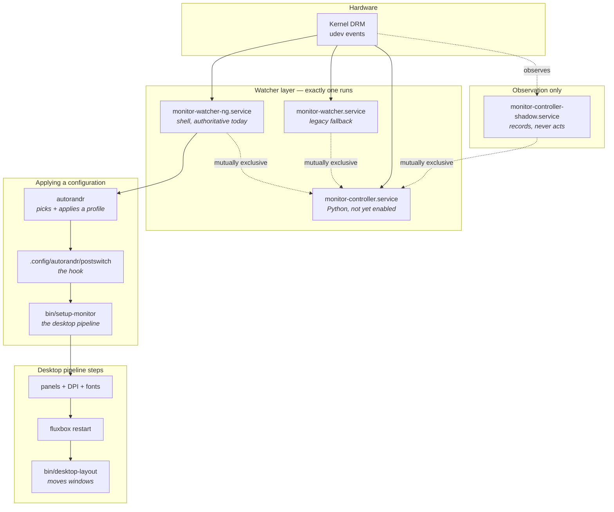

# The monitor system

How your displays get configured when you plug something in, and what to do
when they don't.

This is the operator's guide and the place to start. Three documents cover
three layers, in the order they arrived:

| Document | Covers |
| --- | --- |
| **This one** | The whole picture, and everyday operations |
| [The monitor controller][controller-doc] | The **new** Python state machine that will replace the shell watcher |
| [Autorandr-based monitor management][autorandr-doc] | The autorandr layer both watchers sit on: profile capture, EDID quirks, known limitations |

For **why** the system is built this way, see
[the Python architecture spec][arch] and [the state machine spec][v2].

[controller-doc]: monitor-controller.md
[autorandr-doc]: autorandr-monitor-management.md
[arch]: ../specs/monitor-controller-python-architecture.md
[v2]: ../specs/monitor-watcher-state-machine-v2.md

## The short version

When a monitor is plugged in or removed, the kernel emits a DRM event. A
watcher notices, waits for the hardware to settle, asks **autorandr** to
apply the matching display configuration, and then runs the **desktop
pipeline**: panels, DPI, fonts, terminals, window manager, window layout.

Two things make this harder than it sounds, and most of the design exists to
handle them:

- **Hardware lies during transitions.** A DisplayPort link can take seconds
  to train, and a monitor can report a truncated EDID mid-handshake. Act on
  the first thing you see and you configure for a topology that no longer
  exists.
- **The desktop pipeline is expensive and disruptive.** It restarts the
  window manager and the panel. Running it twice, or for the wrong topology,
  is visible and annoying — and it moves all your windows.

## Architecture



### Who does what

| Component | Role |
| --- | --- |
| `monitor-watcher-ng.service` | **Currently authoritative.** Watches DRM events, waits for quiescence, drives autorandr, then runs the desktop pipeline. |
| `monitor-watcher.service` | Legacy shell watcher. Kept as a rollback target. |
| `monitor-controller-shadow.service` | The Python controller in observe-only mode. Records what it *would* decide. Cannot touch the display. |
| `monitor-controller.service` | The Python controller with authority. Installed but **not enabled** — see [Cutover](#cutover-not-yet-done). |
| `autorandr` | Matches connected monitors against saved profiles and applies the xrandr configuration. |
| `.config/autorandr/postswitch` | Runs after autorandr applies a profile; launches the desktop pipeline. |
| `bin/setup-monitor` | The desktop pipeline: panels, DPI, fonts, terminals, fluxbox, window layout. |
| `bin/desktop-layout` | Moves and resizes windows according to the layout YAML. |

Only one of the three watcher/controller services runs at a time. They
declare `Conflicts=` with each other, so starting one stops the others.
Shadow is the exception: it runs *alongside* the shell watchers, because
observing the live authority is its whole purpose.

### Profiles and layouts are different things

This trips people up, so it's worth being explicit.

- An **autorandr profile** describes the *hardware*: which outputs are on, at
  what resolution and position. Named after the monitors, e.g.
  `celtic+AOC-U28G2G6B`. Lives in `~/.config/autorandr/<profile>/`.
- A **layout** describes the *desktop*: where windows go, how many columns,
  what DPI. Named after the arrangement, e.g. `celtic+external`. Lives in
  `.fluxbox/layouts/<layout>.yaml`.

Several profiles can share one layout — any 4K external monitor gets the same
window arrangement. The mapping is a one-line `layout` file inside the profile
directory. Without one, the profile name *is* the layout name.

```console
$ cat ~/.config/autorandr/celtic+AOC-U28G2G6B/layout
celtic+external
```

## Cookbook

### Which configuration am I in right now?

```bash
get-layout          # the active layout file
monitor-identity    # the connected monitors, by model
autorandr           # saved profiles; the current one is marked
xrandr --listmonitors
```

A worked example:

```console
$ get-layout
/home/adam/.fluxbox/layouts/celtic+external.yaml
$ monitor-identity
DisplayPort-1=AOC U28G2G6B,eDP=BOE NJ NE135A1M-NY1
```

### I plugged in a monitor and nothing happened

First, see whether the watcher noticed:

```bash
journalctl --user -u monitor-watcher-ng --since "10 min ago"
```

Look for `Starting display reconciliation`. If it isn't there, the kernel
never reported the change — usually a cable or hub problem, not software.

If reconciliation started but gave up, you'll see repeated
`Reconciliation attempt N/12`. That means the hardware kept changing, or the
monitor's EDID never became readable. Force it:

```bash
autorandr --change
```

If autorandr can't pick a profile, check whether it recognises the hardware:

```bash
autorandr --detected     # empty means no saved profile matches
```

Empty output with a monitor plugged in means you need to save a profile for
this combination — see [Add a new monitor](#add-a-new-monitor-setup).

### Everything ended up on the laptop screen

Usually after resume from suspend. The external monitor takes a while to come
back, the system concludes you're on laptop-only, and runs the desktop
pipeline for that topology — which moves every window.

Fix the immediate problem:

```bash
autorandr --change     # re-detects and reapplies
```

Mitigated as of `a7f3d3e`: after a resume, a laptop-only topology must now
stay stable for 90 seconds (rather than 10) before it's believed. Tune it by
overriding `POST_RESUME_STABILITY_SECONDS` in the unit if your monitor is
slower still.

### Force a full desktop reconfiguration

When the layout is right but the desktop looks wrong — panel on the wrong
screen, wrong DPI, windows misplaced:

```bash
setup-monitor                      # detect layout, run the whole pipeline
setup-monitor --layout celtic+external   # force a specific layout
```

To move windows without restarting anything:

```bash
desktop-layout celtic+external
```

### Add a new monitor setup

With the monitors connected and arranged as you want them (use
`xfce4-display-settings` or `xrandr` to arrange first):

```bash
autorandr --save celtic+MyNewMonitor
```

Then map it to a layout, either by creating
`.fluxbox/layouts/celtic+MyNewMonitor.yaml`, or by pointing at an existing
layout:

```bash
echo celtic+external > ~/.config/autorandr/celtic+MyNewMonitor/layout
```

Monitors with awkward EDIDs — ones that differ per input, or contain volatile
bytes — need more care than this. See
[Plugging in a new monitor for the first time][autorandr-new] and the
known-limitations section of that document.

[autorandr-new]: autorandr-monitor-management.md#plugging-in-a-new-monitor-for-the-first-time

### Switch which watcher is running

```bash
systemctl --user stop monitor-watcher-ng.service
systemctl --user start monitor-watcher.service
```

They conflict, so starting one stops the other; the explicit stop just makes
the intent obvious. To make it survive login, `enable` the one you want and
`disable` the other.

> An older note said these units are selected by `bin/monitor-system` and
> have empty `[Install]` sections. That script was removed in `1f57823`;
> selection is now ordinary `systemctl --user enable`/`disable`.

### Check what the Python controller thinks

Shadow records decisions without acting on them:

```bash
systemctl --user status monitor-controller-shadow.service
journalctl --user -u monitor-controller-shadow --since today
```

Its decision stream is at
`~/.local/state/monitor-controller/shadow/audit.jsonl` (rotated).
[The monitor controller][controller-doc] explains what those decisions mean.

### How close is the Python controller to taking over?

```bash
shadow-trace-status     # which trace scenarios have been captured
```

Seven scenarios must be recorded before cutover. They accrue from ordinary
use — docking, undocking, suspending — so **nothing needs to be performed
deliberately**.

Check whether cutover would be safe:

```bash
monitor-controller preflight
```

> `bin/monitor-controller` is a thin wrapper around the installed venv, so
> the CLI and the systemd units always run the same deployed code. If your
> shell can't find it, run `mr stow`. If it reports that the venv is
> missing, run `.local/lib/monitor-controller/install.sh`.

It's read-only and exits non-zero if anything blocks:

```console
  [  ok] locked install: /home/adam/.local/share/monitor-controller/venv/bin/python
  [FAIL] no conflicting authority: still active: monitor-watcher-ng.service
  ...
NOT ready: 2 blocking check(s).
```

### Diagnose a missing tray icon or misplaced notification

State is captured automatically after every display change:

```bash
ls ~/.log/tray-diag/          # timestamped, tagged with the layout
tray-diag                     # take one now
```

Each capture records tray selection ownership, panel geometry, Gdk monitor
data, and a live notification-placement probe. To compare a broken moment
against a working one, diff two captures.

### Where the logs are

| What | Where |
| --- | --- |
| Watcher activity | `journalctl --user -u monitor-watcher-ng` |
| Shadow controller | `journalctl --user -u monitor-controller-shadow` |
| DRM events | `~/.log/udev-drm-ng.log` |
| Tray/notification snapshots | `~/.log/tray-diag/` |
| Shadow trace captures | `~/.log/shadow-traces/` |
| Controller decisions | `~/.local/state/monitor-controller/shadow/audit.jsonl` |

## Cutover (not yet done)

The Python controller is intended to replace the shell watcher. It is not
authoritative yet. See [The monitor controller][controller-doc] for what it
is and why it exists; this is just the switchover procedure.

**Preconditions:** the seven trace scenarios captured and reconciled
(`dc-a5y.11`), and `monitor-controller preflight` reporting ready.

Until cutover is authorised the controller refuses to start, naming what is
missing. Starting it also stops the shell watcher via `Conflicts=`, so a
refused start still leaves the desktop unmanaged until you restart
`monitor-watcher-ng.service`.

**When those hold:**

```bash
monitor-controller preflight        # must exit 0
monitor-controller cutover-commands # prints the sequence; review it
```

The sequence stops the other services, starts the controller, verifies it,
and only then enables it — so a controller that fails to start is not retried
at every login.

**If it goes wrong**, rollback works over SSH with no display:

```bash
monitor-controller rollback-commands --target monitor-watcher-ng.service
```

Copy those commands somewhere reachable *before* attempting a cutover. If the
display is broken you may not be able to read this file comfortably.

## Testing

```bash
./bin/test-monitor-watcher-ng        # watcher logic
./bin/test-autorandr-postswitch      # the hook
./bin/test-shadow-trace-status       # trace classification
./bin/test-desktop-layout            # window placement
./bin/test-libdpy                    # display detection

cd .local/lib/monitor-controller && uv run pytest    # the Python controller
```
